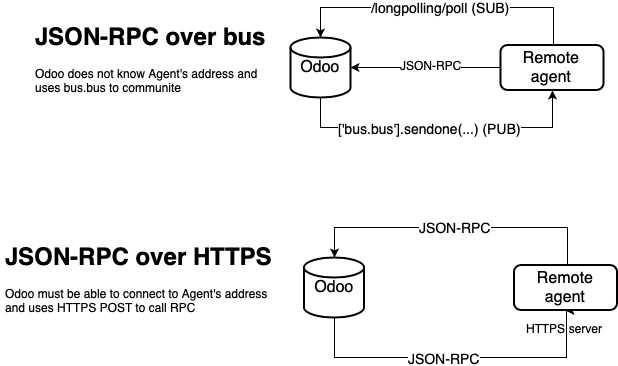

============
Remote Agent
============

Odoo communication framework
============================

The purpose of this framework is to create a common base for different applications 
like IoT boxes or brokers.

Its main goal is to give Odoo a way to call functions on remote side without 
any additional software like message bus (Kafka, RabbitMQ, NATS, etc).

This is possible becuase Odoo itself has its own message bus using 
PostgreSQL NOTIFY / LISTEN features and `bus <https://github.com/odoo/odoo/tree/12.0/addons/bus>`_ module.

Remote Agent uses Odoo's /longpolling/poll controller to keep continuous
connection and by this way is available without a need to know its source address.
In special cases where bus is not available for remote polling (odoo.sh) HTTP channel
is used to communicate between Odoo and Agent though in this case Agent must 
be directly accessible by Odoo.

Diagram
=======

